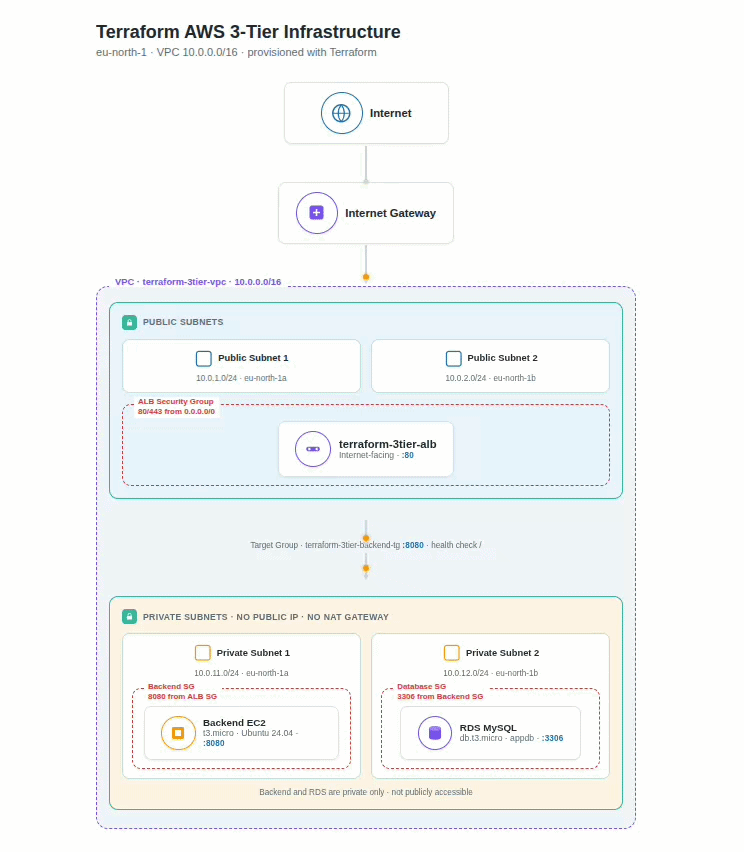
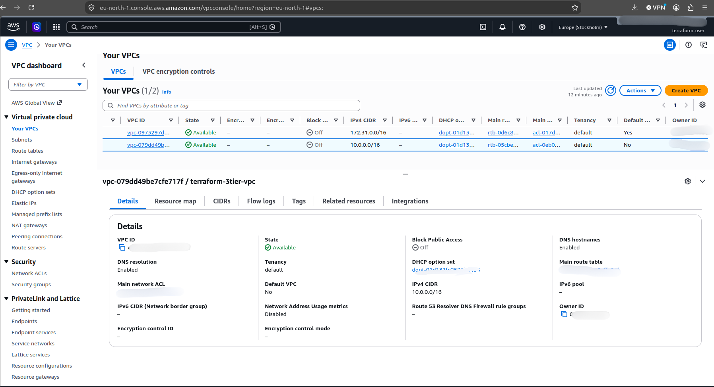
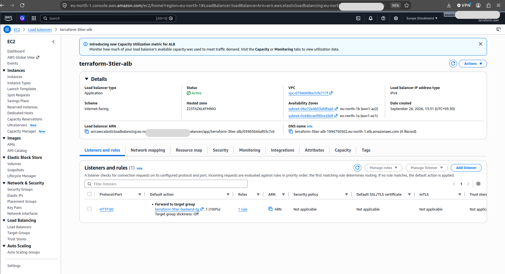
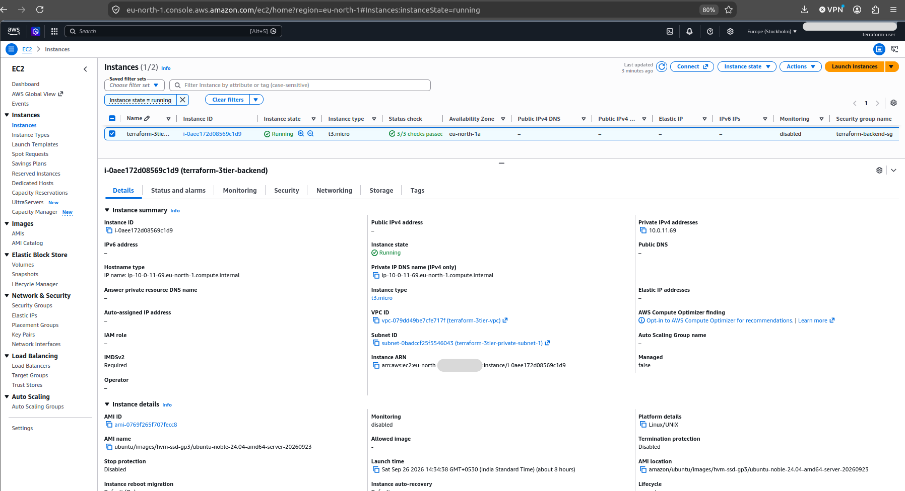
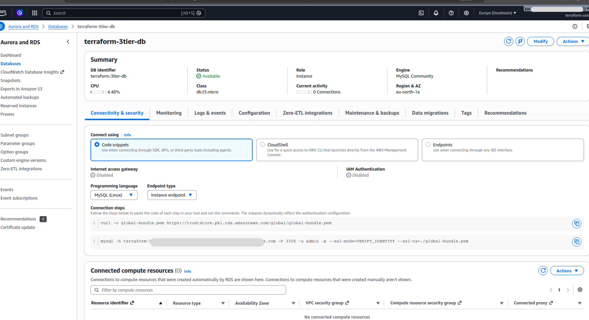

# Terraform AWS 3-Tier Architecture

A hands-on AWS infrastructure project that demonstrates how to provision a basic **3-Tier Architecture using Terraform**.

The infrastructure includes a VPC, public and private subnets, an Application Load Balancer, a private EC2 backend server, and a private RDS MySQL database.

## 🏗️ Architecture


```text
                         Internet
                            │
                            ▼
                  ┌──────────────────┐
                  │   Application    │
                  │   Load Balancer  │
                  │      (ALB)       │
                  └────────┬─────────┘
                           │
                           │ HTTP :80
                           ▼
                  ┌──────────────────┐
                  │   Backend EC2    │
                  │  Private Subnet  │
                  │      :8080       │
                  └────────┬─────────┘
                           │
                           │ MySQL :3306
                           ▼
                  ┌──────────────────┐
                  │    RDS MySQL     │
                  │  Private Subnet  │
                  └──────────────────┘


                 AWS VPC: 10.0.0.0/16

        ┌─────────────────────────────────────┐
        │                                     │
        │  Public Subnets                     │
        │  ├── ALB                            │
        │  ├── Public Subnet 1 (eu-north-1a) │
        │  └── Public Subnet 2 (eu-north-1b) │
        │                                     │
        │  Private Subnets                    │
        │  ├── Backend EC2                    │
        │  ├── Private Subnet 1               │
        │  └── RDS MySQL                      │
        │                                     │
        └─────────────────────────────────────┘
```

## 📸 AWS Infrastructure Screenshots

### 1. VPC Configuration


AWS VPC configured with a `10.0.0.0/16` CIDR block as the networking foundation of the 3-tier architecture.

### 2. VPC and Subnets


Four public and private subnets distributed across multiple Availability Zones.

### 3. Application Load Balancer


Internet-facing Application Load Balancer configured to route HTTP traffic to the backend target group.

### 4. Target Group Health


Backend target group showing a healthy EC2 target on port `8080`.

### 5. Private EC2 Backend


Private EC2 instance configured as the backend layer of the 3-tier infrastructure.

### 6. RDS MySQL Database


Private Amazon RDS MySQL database configured as the database layer.

### 7. ALB Security Group


Security Group controlling inbound traffic to the Application Load Balancer.

### 8. Backend Security Group


Security Group allowing backend traffic only from the Application Load Balancer.

### 9. Database Security Group


Security Group restricting MySQL traffic to the backend security group.

### 10. Terraform Project Structure


Terraform project structure containing the main infrastructure configuration files.

### 11. Terraform Networking Configuration


Terraform configuration for the VPC, public and private networking components.

### 12. Terraform Security and Load Balancing


Terraform configuration for Security Groups, Application Load Balancer and target group.

### 13. Terraform Compute and Database


Terraform configuration for the private EC2 backend and RDS MySQL database.

## ☁️ AWS Services Used

* **Amazon VPC** – Network isolation
* **Public Subnets** – Host the Application Load Balancer
* **Private Subnets** – Host backend and database resources
* **Internet Gateway** – Internet connectivity for public subnets
* **Application Load Balancer** – Distributes HTTP traffic to the backend
* **Amazon EC2** – Backend server
* **Amazon RDS MySQL** – Relational database
* **Security Groups** – Control traffic between application layers
* **Route Tables** – Control network routing

## 🛠️ Technologies

* Terraform
* AWS
* Linux
* Git
* GitHub
* MySQL
* Python

## 📁 Project Structure

```text
terraform-aws-3tier/
│
├── main.tf
├── variables.tf
├── outputs.tf
├── .gitignore
├── .terraform.lock.hcl
├── README.md
```

## 🔐 Security

Security groups are configured to control communication between the layers.

```text
Internet
   │
   ▼
ALB
Port 80
   │
   ▼
Backend EC2
Port 8080
   │
   ▼
RDS MySQL
Port 3306
```

The database is configured as **not publicly accessible**.

Database credentials are stored in `terraform.tfvars`, which is excluded from Git using `.gitignore`.

## 🚀 Deployment

### 1. Configure AWS credentials

```bash
aws configure
```

Set the required AWS region and credentials.

### 2. Initialize Terraform

```bash
terraform init
```

### 3. Validate the configuration

```bash
terraform validate
```

### 4. Review the infrastructure plan

```bash
terraform plan
```

### 5. Create the infrastructure

```bash
terraform apply
```

Type:

```text
yes
```

when Terraform asks for confirmation.

## 🔍 Testing

After deployment, Terraform provides the Application Load Balancer DNS name.

You can test the backend through the ALB:

```bash
curl http://$(terraform output -raw alb_dns_name)
```

Expected response:

```text
Terraform 3-Tier Backend is Running!
```

This confirms that traffic can flow from the Internet through the ALB to the private EC2 backend.

## 📤 Terraform Outputs

The project provides outputs for:

* Application Load Balancer DNS name
* Backend EC2 private IP
* RDS endpoint

View them with:

```bash
terraform output
```

## 🧹 Destroy Infrastructure

AWS resources such as the ALB, EC2 instance, and RDS database may incur charges.

When the project is no longer needed:

```bash
terraform destroy
```

Type:

```text
yes
```

to confirm.

> **Warning:** `terraform destroy` removes the infrastructure managed by this Terraform configuration. The RDS configuration uses `skip_final_snapshot = true`, so the database can be deleted without a final snapshot.

## 🎯 Learning Objectives

This project helped me practice:

* Infrastructure as Code (IaC)
* Terraform resource management
* AWS VPC networking
* Public and private subnet design
* Application Load Balancer configuration
* EC2 deployment
* RDS MySQL deployment
* Security Group configuration
* Terraform variables and outputs
* Terraform state management
* Git and GitHub workflow
* Basic cloud security concepts

## 👩‍💻 Author

**Hirunodhya**

GitHub: [Hirunodhya2003](https://github.com/Hirunodhya2003)

---

⭐ If you find this project useful, feel free to explore the repository.
